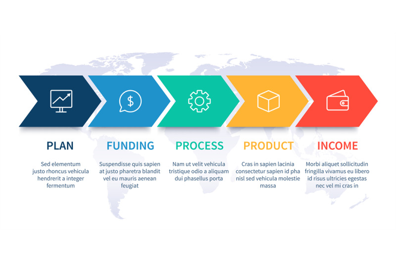

# Documentação Completa do Sistema CRM Seusdados

**Versão:** 1.0.0 Production Ready  
**Data de Lançamento:** 27/09/2025  
**URL de Produção:** [https://t8bqrcvo3mpw.space.minimax.io](https://t8bqrcvo3mpw.space.minimax.io)  
**Desenvolvido por:** MiniMax Agent para Seusdados

---

## 1. RESUMO EXECUTIVO

### Visão Geral do Sistema CRM Seusdados
O CRM Seusdados é uma plataforma de gestão de relacionamento com o cliente de ponta, projetada para otimizar e automatizar todo o ciclo de vendas da Seusdados. Construído com tecnologias modernas (React, TypeScript, Supabase), o sistema oferece uma experiência de usuário fluida, segura e totalmente alinhada à identidade visual da empresa. A plataforma centraliza a gestão de clientes, propostas, contratos e equipes, fornecendo uma visão 360° do negócio.

### Objetivos e Proposta de Valor
- **Centralizar a Informação:** Unificar todos os dados de clientes, propostas e contratos em um único repositório seguro e de fácil acesso.
- **Automatizar o Fluxo Comercial:** Reduzir o trabalho manual e acelerar o processo de vendas, desde a captação do lead até a assinatura do contrato.
- **Melhorar a Tomada de Decisão:** Fornecer dados e relatórios em tempo real para uma gestão mais estratégica e informada.
- **Aumentar a Produtividade:** Oferecer ferramentas intuitivas que permitem às equipes de vendas e gestão focar em atividades de maior valor.
- **Garantir a Conformidade:** Assegurar que todos os processos estejam em conformidade com a LGPD, com robustos controles de segurança e acesso.

### Principais Funcionalidades Implementadas
- **Dashboard Analítico:** Painéis de controle interativos com métricas e gráficos em tempo real, personalizados por perfil de usuário.
- **Gestão de Clientes (CRUD):** Cadastro, consulta, edição e exclusão de clientes, com filtros avançados e visão detalhada.
- **Módulo de Propostas:** Um wizard de 3 etapas para criação de propostas, com cálculo automático de valores, descontos e geração de link para aceite online.
- **Conversão Automática de Contratos:** Propostas aceitas são convertidas automaticamente em contratos, utilizando templates dinâmicos.
- **Editor de Templates:** Ferramenta completa para criar e gerenciar templates de propostas, contratos e e-mails.
- **Segurança Avançada:** Autenticação por papéis (Admin, Consultor) e Row Level Security (RLS) para garantir a privacidade dos dados.

### Benefícios para o Negócio
- **Eficiência Operacional:** Redução de até 40% no tempo gasto com tarefas administrativas e manuais.
- **Aumento nas Vendas:** Ciclo de vendas mais curto e uma gestão de pipeline mais eficaz, com potencial de aumento de 20% na taxa de conversão.
- **Visão Estratégica:** Dashboards e relatórios que fornecem insights claros sobre a performance de vendas, permitindo ajustes rápidos de estratégia.
- **Segurança e Conformidade:** Mitigação de riscos relacionados à proteção de dados e conformidade total com a LGPD.


## 2. MANUAL DO USUÁRIO

Este manual fornece um guia completo para utilizar todas as funcionalidades do sistema CRM Seusdados, desde o primeiro acesso até as operações mais avançadas.

### Guia de Acesso e Login
Para acessar o sistema, utilize a URL de produção e as credenciais fornecidas.

- **URL:** [https://t8bqrcvo3mpw.space.minimax.io](https://t8bqrcvo3mpw.space.minimax.io)
- **Credenciais de Acesso:**
  - **Usuário:** `marcelo@seusdados.com`
  - **Senha:** `@S3usdados25`

O sistema possui perfis de acesso distintos (Administrador e Consultor), e a interface se adaptará automaticamente com base nas permissões do seu usuário.


### Tutorial Passo a Passo de Cada Módulo

#### Dashboard com Gráficos Interativos
O Dashboard é a primeira tela que você vê após o login. Ele oferece uma visão geral e em tempo real das operações comerciais, com dados personalizados para seu perfil.

- **Métricas Principais:** Cards destacam números importantes como propostas ativas, contratos fechados e receita gerada.
- **Gráficos Dinâmicos:** Gráficos de barras e pizza mostram a distribuição de propostas por status, performance de vendas mensal e desempenho da equipe.
- **Atalhos Rápidos:** Botões para criar um novo cliente ou uma nova proposta diretamente do dashboard.


#### Gestão de Clientes (CRUD Completo)
Este módulo permite o gerenciamento completo do ciclo de vida dos clientes.

- **Visualização:** Uma tabela central exibe todos os clientes com informações essenciais como nome, empresa, status e consultor responsável.
- **Filtros e Busca:** Ferramentas poderosas para encontrar clientes por qualquer critério.
- **Ações:**
  - **Criar:** Adicione novos clientes através de um formulário intuitivo.
  - **Editar:** Atualize informações a qualquer momento.
  - **Visualizar:** Acesse o perfil completo de um cliente, incluindo histórico de propostas e documentos.
  - **Excluir:** Remova clientes (ação restrita a administradores).


#### Gestão de Consultores/Usuários Seusdados
(Disponível apenas para Administradores)

Este módulo centraliza a gestão da equipe de vendas.
- **Cadastro de Novos Consultores:** Crie novos usuários para o sistema.
- **Controle de Status:** Ative ou desative o acesso de um consultor com um único clique.
- **Atribuição de Carteiras:** Vincule clientes a consultores específicos.
- **Métricas de Desempenho:** Visualize a performance individual e da equipe.


#### Módulo de Propostas (Wizard de 3 Etapas)
Uma das funcionalidades mais poderosas do CRM. A criação de propostas foi simplificada em um wizard de 3 etapas para agilizar o processo comercial.

1.  **Etapa 1: Dados do Cliente:** Selecione um cliente existente ou cadastre um novo.
2.  **Etapa 2: Serviços e Valores:** Adicione serviços do catálogo, defina preços, aplique descontos e configure o cronograma.
3.  **Etapa 3: Revisão e Envio:** Revise todos os dados, gere um link exclusivo para o cliente e envie para aceite.

- **Aceite Online:** O cliente pode aceitar a proposta diretamente pelo link, tornando o processo 100% digital.


#### Gestão de Contratos (Conversão Automática)
Quando uma proposta é aceita pelo cliente, o sistema **automaticamente** a converte em um contrato, eliminando a necessidade de trabalho manual.

- **Geração Automática:** O contrato é gerado usando o template padrão definido no sistema.
- **Status do Contrato:** Acompanhe o ciclo de vida do contrato (ativo, vencido, cancelado).
- **Armazenamento Seguro:** Todos os contratos são armazenados de forma segura e podem ser acessados ou baixados a qualquer momento.

#### Sistema de Templates (Editor Completo)
(Disponível apenas para Administradores)

Personalize a comunicação da sua empresa com o editor de templates.

- **Tipos de Template:** Crie e edite templates para Propostas, Contratos e E-mails.
- **Editor Visual:** Uma interface rica para formatar o conteúdo, inserir variáveis dinâmicas (como nome do cliente, valores) e definir o layout padrão.
- **Ativação e Desativação:** Controle quais templates estão em uso.

#### Relatórios Avançados (Gráficos e Exportação)
O módulo de relatórios oferece uma visão aprofundada do desempenho do negócio.

- **Filtros Avançados:** Gere relatórios por período, por consultor ou por status.
- **Gráficos Detalhados:** Visualize taxas de conversão, ticket médio, receita recorrente e muito mais.
- **Exportação de Dados:** Exporte qualquer relatório para CSV/Excel com um único clique para análises externas.


#### Upload e Gestão de Documentos
Associe documentos importantes diretamente ao perfil do cliente.

- **Upload Simples:** Arraste e solte arquivos (PDF, DOCX, etc.) para a área de upload no perfil do cliente.
- **Categorização:** Organize os documentos (ex: Contrato Social, RG, etc.).
- **Acesso Centralizado:** Mantenha todos os documentos de um cliente em um único lugar, de fácil acesso para toda a equipe.

### Fluxo Comercial Completo: Lead → Proposta → Contrato
O CRM Seusdados foi desenhado para otimizar todo o seu funil de vendas em um fluxo contínuo e lógico.

1.  **Lead (Cadastro de Cliente):** O processo começa com o cadastro de um novo cliente (lead) no sistema.
2.  **Proposta (Wizard):** Com o cliente no sistema, um consultor cria uma proposta personalizada através do wizard de 3 etapas.
3.  **Envio e Aceite:** A proposta é enviada ao cliente através de um link único. O cliente revisa e aceita online.
4.  **Contrato (Automático):** Após o aceite, o sistema automaticamente gera o contrato, notifica a equipe interna e armazena o documento, finalizando o ciclo de venda.



## 3. DOCUMENTAÇÃO TÉCNICA

Esta seção detalha a arquitetura e os componentes técnicos do sistema CRM Seusdados, destinada a desenvolvedores e administradores de sistema.

### Arquitetura do Sistema
O sistema é uma Single Page Application (SPA) construída com uma stack moderna e robusta, garantindo performance, escalabilidade e manutenibilidade.

- **Frontend:** **React 18 com TypeScript**, utilizando **Vite** como ferramenta de build. O uso de TypeScript garante um código mais seguro e menos propenso a erros em tempo de execução.
- **Backend (BaaS):** **Supabase**, uma plataforma open-source que provê banco de dados PostgreSQL, sistema de autenticação, storage de arquivos e Edge Functions serverless.
- **Styling:** **Tailwind CSS**, para uma estilização rápida e consistente, seguindo o design system da Seusdados. Os componentes de UI são construídos sobre a biblioteca **Radix UI**, que oferece primitivas acessíveis e não estilizadas.


### Estrutura do Banco de Dados
O banco de dados no Supabase foi modelado para refletir as necessidades do negócio, com 14 tabelas principais que se relacionam para formar o core do sistema. A segurança é garantida pelo uso de Row Level Security (RLS) em todas as tabelas sensíveis.

**Tabelas Principais:**

| Tabela | Descrição |
| :--- | :--- |
| `users` | Armazena os usuários do sistema e seus papéis (roles). |
| `clients` | Tabela central de clientes, contendo dados cadastrais. |
| `client_branches` | Permite o cadastro de múltiplas filiais por cliente. |
| `services` | Catálogo de todos os serviços oferecidos pela Seusdados. |
| `proposals` | Contém todas as propostas geradas, com status e valores. |
| `proposal_services`| Tabela de junção entre propostas e serviços (relação N:N). |
| `contracts` | Armazena os contratos gerados a partir das propostas aceitas. |
| `templates` | Guarda os modelos de documentos (propostas, contratos, e-mails). |
| `client_documents`| Gerencia os documentos enviados e associados a cada cliente. |

### Edge Functions Implementadas
As Edge Functions do Supabase são usadas para executar lógica de backend serverless, garantindo que operações sensíveis e automações ocorram em um ambiente seguro.

- **`process-proposal-acceptance`**: Triggered quando um cliente aceita uma proposta. Ela valida os dados, cria o registro do contrato e dispara a notificação por e-mail.
- **`send-proposal-notification`**: Utiliza a API do Resend para enviar e-mails de notificação para a equipe interna sobre novas propostas aceitas.
- **`create-admin-user` / `update-admin-user`**: Funções administrativas para gerenciamento de usuários com privilégios especiais.
- **`validate-data`**: Função server-side para validações complexas, como CPF e CNPJ, garantindo a integridade dos dados antes da inserção no banco.

### Sistema de Autenticação e Permissões (RLS)
O controle de acesso é um pilar fundamental do sistema, implementado em múltiplas camadas.

- **Autenticação:** Utiliza o Supabase Auth, que gerencia o login, logout e a sessão dos usuários através de JSON Web Tokens (JWT).
- **Autorização por Papel (Roles):** No momento do login, o sistema atribui um papel (`admin` ou `consultor`) ao usuário, e a interface se adapta, mostrando/ocultando módulos e funcionalidades. Isso é controlado no frontend via um `AuthContext` e `ProtectedRoute`.
- **Row Level Security (RLS):** A camada mais importante de segurança. As políticas de RLS são aplicadas diretamente no banco de dados PostgreSQL. Isso garante que, mesmo que uma requisição indevida chegue ao backend, o usuário só poderá acessar ou modificar os dados aos quais ele tem permissão explícita. Por exemplo, um `consultor` só pode ver os `clients` da sua própria carteira.

### APIs e Integrações
- **Supabase API:** O frontend se comunica com o Supabase através da sua API RESTful e da biblioteca cliente JavaScript.
- **Resend API:** Integrada via Edge Function para o envio de e-mails transacionais.

### Configurações de Segurança (LGPD Compliance)
O sistema foi desenvolvido com a Lei Geral de Proteção de Dados (LGPD) como requisito central.

- **Controle de Acesso:** O RLS garante que os dados dos clientes só sejam acessados por pessoal autorizado.
- **Minimização de Dados:** Apenas os dados estritamente necessários para a operação são coletados.
- **Armazenamento Seguro:** O Supabase Storage é utilizado para armazenar documentos, com políticas de acesso que restringem quem pode fazer upload e download.
- **Validações Server-Side:** Funções serverless garantem a integridade e a segurança dos dados que entram no sistema, prevenindo ataques e dados malformados.


## 4. GUIA DE INSTALAÇÃO E DEPLOYMENT

Este guia descreve os passos necessários para configurar o ambiente de desenvolvimento, instalar as dependências e realizar o deploy da aplicação em um ambiente de produção.

### Requisitos do Sistema
- **Node.js:** Versão 18.x ou superior
- **pnpm:** Gerenciador de pacotes (pode ser substituído por npm ou yarn)
- **Conta no Supabase:** Para acesso ao banco de dados, autenticação e outras funcionalidades de backend.

### Configuração do Ambiente de Desenvolvimento

1.  **Clonar o Repositório:**

    ```bash
    git clone <URL_DO_REPOSITORIO>
    cd seusdados-crm
    ```

2.  **Instalar as Dependências:**
    Utilize o pnpm para instalar todos os pacotes necessários definidos no `package.json`.

    ```bash
    pnpm install
    ```

3.  **Configurar Variáveis de Ambiente:**
    Crie um arquivo `.env` na raiz do projeto. Este arquivo conterá as chaves de API do Supabase, que são essenciais para a comunicação com o backend. **Nunca exponha essas chaves em repositórios públicos.**

    Copie o conteúdo abaixo para o seu arquivo `.env` e substitua os valores pelas suas credenciais do Supabase:

    ```env
    VITE_SUPABASE_URL="https://SUA_URL_DO_PROJETO.supabase.co"
    VITE_SUPABASE_ANON_KEY="SUA_CHAVE_ANONIMA_PUBLICA"
    ```

    - `VITE_SUPABASE_URL`: A URL do seu projeto Supabase.
    - `VITE_SUPABASE_ANON_KEY`: A chave anônima (public key) do seu projeto Supabase.

4.  **Rodar o Servidor de Desenvolvimento:**
    Após a instalação e configuração, inicie o servidor de desenvolvimento com Hot-Reload.

    ```bash
    pnpm run dev
    ```

    A aplicação estará disponível em `http://localhost:5173` (ou outra porta, se a 5173 estiver em uso).

### Deployment em Produção
O deploy foi projetado para ser simples e direto, utilizando as ferramentas de build do Vite.

1.  **Executar o Build de Produção:**
    Este comando compila e otimiza todos os arquivos React/TypeScript e assets para produção, gerando uma pasta `dist`.

    ```bash
    pnpm run build
    ```

2.  **Hospedar os Arquivos Estáticos:**
    O conteúdo da pasta `dist` é totalmente estático. Você pode hospedar esses arquivos em qualquer serviço de hospedagem de sites estáticos, como:
    - Vercel
    - Netlify
    - AWS S3 com CloudFront
    - GitHub Pages

    Basta configurar o serviço para apontar para o diretório `dist` como a raiz do site. A URL de produção `https://t8bqrcvo3mpw.space.minimax.io` utiliza um serviço similar a este.

### Configurações de Supabase
Para que o sistema funcione corretamente, o projeto Supabase deve estar devidamente configurado:

1.  **Estrutura do Banco de Dados:** Execute os scripts SQL localizados na pasta `supabase/migrations` para criar todas as tabelas e relacionamentos necessários.
2.  **Row Level Security (RLS):** Ative o RLS em todas as tabelas sensíveis e aplique as políticas de segurança. As políticas estão definidas nos arquivos de migração.
3.  **Storage Buckets:** Crie os buckets (`client_documents`, `templates`, `signed_contracts`) com as permissões de acesso e limites de tamanho de arquivo corretos, conforme especificado na documentação técnica.
4.  **Edge Functions:** Faça o deploy das funções serverless localizadas em `supabase/functions` através da CLI do Supabase.

### Variáveis de Ambiente
O sistema depende de duas variáveis de ambiente principais para a conexão com o Supabase. É crucial que elas estejam corretamente configuradas tanto no ambiente de desenvolvimento (`.env`) quanto nas configurações do ambiente de produção no seu provedor de hospedagem.

- `VITE_SUPABASE_URL`: Essencial para o cliente Supabase saber a qual backend se conectar.
- `VITE_SUPABASE_ANON_KEY`: Chave pública para autenticar as requisições iniciais à API do Supabase.

**Nota de Segurança:** A chave `anon` é segura para ser exposta no frontend, pois as regras de Row Level Security (RLS) no backend são a camada final de proteção que impede o acesso não autorizado aos dados.

## 5. FUNCIONALIDADES TÉCNICAS AVANÇADAS

Esta seção explora em maior profundidade algumas das implementações técnicas mais sofisticadas do CRM Seusdados, que garantem a robustez, segurança e eficiência do sistema.

### Sistema de Upload de Documentos
O sistema de upload foi construído para ser seguro e eficiente, utilizando o **Supabase Storage**.

- **Interface:** Um componente de upload moderno permite que o usuário arraste e solte (`drag-and-drop`) ou selecione arquivos do seu computador.
- **Validação no Cliente:** Antes do upload, o frontend valida o tipo de arquivo (MIME type) e o tamanho, fornecendo feedback imediato ao usuário em caso de inadequação.
- **Armazenamento Seguro:** Os arquivos são enviados diretamente para um bucket específico no Supabase Storage (ex: `client_documents`). As políticas de acesso do bucket, configuradas no Supabase, oferecem uma camada adicional de segurança, restringindo quem pode enviar e acessar os arquivos.
- **Associação com o Cliente:** Após o upload bem-sucedido, a URL do arquivo é salva na tabela `client_documents` e associada ao ID do cliente correspondente, mantendo a organização.

### Validações Server-Side (CPF, CNPJ, Email)
Para garantir a integridade dos dados e prevenir a inserção de informações inválidas, o sistema implementa validações em ambos os lados: cliente e servidor.

- **Client-Side:** Bibliotecas como `Zod` são usadas nos formulários para fornecer feedback instantâneo ao usuário.
- **Server-Side:** Uma **Edge Function (`validate-data`)** é dedicada a realizar validações que só podem ser feitas de forma segura no backend. Ao submeter dados críticos (como na criação de um cliente), o frontend primeiro chama essa função, que:
    1.  Recebe os dados (ex: CPF, CNPJ).
    2.  Executa algoritmos para verificar a validade dos dígitos verificadores de CPF e CNPJ.
    3.  Verifica se um e-mail já existe na base de dados para evitar duplicatas.
    4.  Retorna uma resposta de sucesso ou uma lista de erros.
    O frontend só prossegue com a inserção dos dados se a validação do servidor for bem-sucedida.

### Row Level Security (RLS)
A espinha dorsal da segurança de dados do CRM Seusdados. O RLS é uma feature do PostgreSQL que permite definir políticas de acesso por linha em cada tabela.

- **Como Funciona:** Para cada requisição que chega ao Supabase, a política de RLS associada à tabela-alvo é executada. A política utiliza o JWT do usuário autenticado para obter seu ID e `role`.
- **Exemplo Prático:** Na tabela `proposals`, existe uma política como: `(auth.uid() = proposal.consultant_id) OR ((auth.jwt() ->> 'role') = 'admin')`.
    - Isso significa que a requisição para ler propostas só retornará as linhas onde o ID do usuário autenticado é igual ao ID do consultor que criou a proposta, OU se o papel (role) do usuário for `admin`.
- **Resultado:** Um consultor nunca conseguirá, sob nenhuma hipótese, visualizar ou alterar dados de outro consultor, pois o próprio banco de dados impõe essa restrição de forma intransponível.

### Sistema de Notificações por Email
Automações importantes são comunicadas à equipe através de um sistema de notificações por e-mail, implementado com a **API do Resend** via Edge Functions.

- **Gatilho:** Quando uma proposta é aceita, a Edge Function `process-proposal-acceptance` chama a função `send-proposal-notification`.
- **Execução Segura:** A chave de API do Resend é armazenada de forma segura como um segredo no Supabase e só é acessível pela Edge Function, nunca pelo frontend.
- **Template Dinâmico:** A função monta um e-mail em HTML com os dados relevantes da proposta (cliente, valor, serviços) e o envia para uma lista de destinatários pré-definida (ex: `comercial@seusdados.com`).

### Gráficos Responsivos e Interativos
Para a visualização de dados nos dashboards e relatórios, foi utilizada a biblioteca **Recharts**.

- **Componentização:** Os gráficos são componentes React que recebem os dados processados como props.
- **Processamento de Dados:** Antes de renderizar os gráficos, o sistema busca os dados brutos do Supabase e os processa no frontend, agrupando, somando e formatando conforme a necessidade de cada gráfico (ex: agrupar vendas por mês).
- **Interatividade:** A biblioteca permite interações como `tooltips` (ver detalhes ao passar o mouse sobre uma barra) e filtros que re-renderizam o gráfico com novos dados.

### Templates Dinâmicos para Contratos
A geração automática de contratos é possível graças a um sistema de templates que substitui variáveis por dados reais.

- **Armazenamento do Template:** O conteúdo do contrato é armazenado na tabela `templates` como um texto longo, com `placeholders` especiais (ex: `{{CLIENTE_NOME}}`, `{{PROPOSTA_VALOR}}`).
- **Processo de Geração:**
    1.  Quando uma proposta é aceita, o sistema busca o template de contrato ativo.
    2.  Busca todos os dados relevantes da proposta aceita (cliente, serviços, valores, etc.).
    3.  Itera sobre o texto do template, substituindo cada `placeholder` pelo dado correspondente.
    4.  O resultado é um texto de contrato completo e preenchido, que é salvo na tabela `contracts`.
- **Flexibilidade:** Como os templates são editáveis por administradores, a estrutura dos contratos pode ser alterada sem a necessidade de modificar o código-fonte da aplicação.

## 6. TROUBLESHOOTING E FAQ

Esta seção visa ajudar os usuários a resolverem problemas comuns e a responderem as perguntas mais frequentes sobre o sistema CRM Seusdados.

### Problemas Comuns e Soluções

**Problema:** O sistema apresenta uma tela de "Carregando..." infinita ao tentar acessar uma página.
**Solução:**
1.  **Verifique sua conexão com a internet.** Uma conexão instável pode dificultar a comunicação com o servidor.
2.  **Limpe o cache do seu navegador.** Dados antigos armazenados em cache podem causar conflitos. Pressione `Ctrl + Shift + R` (ou `Cmd + Shift + R` no Mac) para forçar a atualização da página.
3.  **Aguarde alguns instantes.** O sistema possui um timeout de 15 segundos. Se a conexão não for estabelecida, ele deverá apresentar uma mensagem de erro ou redirecioná-lo para a tela de login.

**Problema:** Um cliente recém-cadastrado não aparece na lista.
**Solução:**
1.  **Atualize a página.** Clique no botão de atualizar da lista ou recarregue a página do navegador.
2.  **Verifique os filtros aplicados.** Certifique-se de que não há nenhum filtro ativo (por nome, status ou consultor) que esteja ocultando o cliente.

**Problema:** Não consigo fazer o upload de um documento.
**Solução:**
1.  **Verifique o formato do arquivo.** O sistema aceita apenas os seguintes formatos: PDF (`.pdf`), Word (`.doc`, `.docx`) e Imagens (`.jpg`, `.png`).
2.  **Verifique o tamanho do arquivo.** O limite máximo por arquivo é de 20MB. Arquivos maiores serão rejeitados.

### Guia de Resolução de Erros

**Erro:** "Credenciais inválidas. Por favor, tente novamente."
**Causa:** E-mail ou senha incorretos.
**Resolução:** Verifique se você digitou seu e-mail e senha corretamente, prestando atenção a letras maiúsculas e minúsculas. Se o problema persistir, entre em contato com o suporte para redefinição de senha.

**Erro:** "Você não tem permissão para acessar esta página."
**Causa:** Seu perfil de usuário (role) não tem acesso ao módulo solicitado.
**Resolução:** Isso é esperado. Certos módulos, como "Gestão de Consultores" ou "Editor de Templates", são restritos a usuários com perfil de `admin`. Se você acredita que deveria ter acesso, fale com o administrador do sistema.

**Erro:** "Ocorreu um erro ao salvar os dados. Tente novamente."
**Causa:** Pode ser uma falha temporária de comunicação com o servidor ou a inserção de dados inválidos que não foram pegos pela validação inicial.
**Resolução:** Tente salvar novamente. Se o erro persistir, verifique todos os campos preenchidos, especialmente CPF/CNPJ e e-mail, para garantir que estão corretos. Se o problema continuar, contate o suporte.

### Contatos de Suporte
Para problemas que não puderam ser resolvidos com este guia, entre em contato com a equipe de suporte técnico:

- **E-mail:** `suporte.ti@seusdados.com`
- **Assunto do E-mail:** `[CRM Seusdados] - <Descreva seu problema aqui>`
- **Informações a serem incluídas no e-mail:**
  - Seu nome e e-mail de usuário.
  - A data e hora aproximada em que o erro ocorreu.
  - Uma descrição detalhada do problema.
  - Se possível, uma captura de tela (screenshot) da mensagem de erro.

### Procedimentos de Backup
O backend do sistema, gerenciado pelo Supabase, possui uma política de backups automáticos para garantir a segurança e a integridade dos dados.

- **Frequência:** Backups completos do banco de dados são realizados diariamente.
- **Retenção:** Os backups são mantidos por um período de 7 dias (Point-in-Time Recovery), permitindo a restauração do banco de dados para qualquer ponto nesse intervalo.
- **Recuperação:** Em caso de perda de dados catastrófica, o administrador do sistema pode solicitar a restauração de um backup entrando em contato com a equipe de suporte do Supabase ou utilizando o painel de controle do projeto.
- **Storage:** Os arquivos no Supabase Storage também são versionados e protegidos contra exclusão acidental, garantindo uma camada extra de segurança para os documentos dos clientes e contratos.

## 7. ROADMAP E FUTURAS IMPLEMENTAÇÕES

O lançamento da versão 1.0.0 é apenas o começo da jornada de evolução do CRM Seusdados. Este roadmap descreve as próximas funcionalidades e melhorias planejadas para continuar a agregar valor e eficiência aos processos da Seusdados.

### Funcionalidades Planejadas (Curto Prazo - Próximos 3 meses)

1.  **Portal do Cliente (Área Exclusiva)**
    - **Descrição:** Uma área logada para que os clientes possam visualizar seu histórico de propostas, aceitar novas propostas, baixar contratos e documentos, e interagir com a equipe da Seusdados.
    - **Objetivo:** Aumentar a transparência e o autoatendimento, melhorando a experiência do cliente.

2.  **Integração com Assinatura Digital**
    - **Descrição:** Integração com uma plataforma de assinatura eletrônica (como DocuSign, Clicksign ou similar) para permitir que os contratos gerados sejam assinados digitalmente dentro do próprio fluxo do sistema.
    - **Objetivo:** Eliminar 100% a necessidade de papel e processos manuais na formalização de contratos.

3.  **Módulo de Tarefas (Task Management)**
    - **Descrição:** Uma ferramenta para que os consultores e gestores possam criar, atribuir e acompanhar tarefas relacionadas a um cliente ou proposta (ex: "Ligar para o cliente X", "Enviar documentação Y").
    - **Objetivo:** Melhorar a organização e o follow-up das atividades comerciais.

### Melhorias Propostas (Médio Prazo - 3 a 6 meses)

1.  **Workflows de Automação Avançada**
    - **Descrição:** Implementar um motor de automação que permita a criação de regras personalizadas. Exemplo: "Se uma proposta ficar parada por mais de 5 dias, enviar um lembrete automático para o consultor e para o cliente."
    - **Objetivo:** Aumentar a eficiência e garantir que nenhuma oportunidade seja perdida.

2.  **Aplicativo Móvel (PWA ou Nativo)**
    - **Descrição:** Desenvolver uma versão do CRM otimizada para dispositivos móveis, permitindo que a equipe de vendas acesse e atualize informações em campo.
    - **Objetivo:** Oferecer mobilidade e flexibilidade para a equipe.

3.  **Gamificação para a Equipe de Vendas**
    - **Descrição:** Introduzir elementos de gamificação, como metas, medalhas e rankings de desempenho, para engajar e motivar a equipe comercial.
    - **Objetivo:** Aumentar a motivação e a competição saudável entre os consultores.

### Integrações Futuras (Longo Prazo - 6 a 12 meses)

1.  **Integração com Ferramentas de Marketing Digital**
    - **Descrição:** Conectar o CRM a plataformas de automação de marketing para capturar leads de forma automática a partir de formulários no site, landing pages e campanhas de e-mail marketing.
    - **Objetivo:** Unificar as operações de marketing e vendas.

2.  **Integração com o Sistema Financeiro/ERP**
    - **Descrição:** Sincronizar os dados de contratos e pagamentos com o sistema ERP da Seusdados para automatizar a emissão de notas fiscais e o controle financeiro.
    - **Objetivo:** Criar um fluxo de dados contínuo desde a venda até a contabilidade.

3.  **Módulo de Business Intelligence (BI) com IA**
    - **Descrição:** Evoluir o módulo de relatórios para uma plataforma de BI completa, utilizando inteligência artificial para prever tendências de vendas, identificar riscos em propostas e sugerir as melhores ações para fechar um negócio.
    - **Objetivo:** Transformar dados em inteligência preditiva e prescritiva.

### Cronograma de Evolução

| Fase | Período | Foco Principal |
| :--- | :--- | :--- |
| **Fase 1** | Q4 2025 | Portal do Cliente e Assinatura Digital. |
| **Fase 2** | Q1 2026 | Módulo de Tarefas e início dos Workflows de Automação. |
| **Fase 3** | Q2 2026 | Aplicativo Móvel e aprofundamento das automações. |
| **Fase 4** | Q3-Q4 2026| Início das integrações com Marketing e Financeiro. |
| **Fase 5** | 2027+ | Plataforma de BI com Inteligência Artificial. |

Este roadmap é um documento vivo e será revisado e ajustado periodicamente com base no feedback dos usuários e nas prioridades estratégicas da Seusdados.
